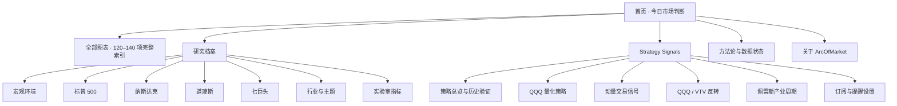

# ArcOfMarket Web 产品与叙事设计

- 状态：设计方向稿
- 版本：1.0
- 日期：2026-07-27

逐页模块、完整 Sitemap 与图表分配见
[WEB_SITEMAP_AND_CHART_MAP.md](./WEB_SITEMAP_AND_CHART_MAP.md)。

## 1. 文档目的

本文定义 ArcOfMarket Web 端下一阶段的产品结构、首页叙事、图表阅读顺序、
页内导航和 Strategy Signals 订阅体验。

本文接管的是用户体验与信息架构决策，不覆盖以下既有规范：

- 数据来源、许可和公开范围：
  [PRODUCT_BLUEPRINT.md](./PRODUCT_BLUEPRINT.md)
- 120–140 项图表能力与覆盖矩阵：
  [product-redesign-coverage.md](./product-redesign-coverage.md)
- 技术与部署边界：
  [ARCHITECTURE.md](./ARCHITECTURE.md)
- 数据授权、策略正确性和付费发布门禁：
  继续以现有专项文档与配置为准。

本轮只形成设计规范，不代表前端代码已经修改。

## 2. 产品目标

ArcOfMarket 不应只是“有很多图的市场网站”。
它应成为一份每天帮助用户完成三件事的市场研究刊物：

1. 用一句话知道今天最重要的变化。
2. 用少量关键数据验证这个判断。
3. 在需要行动时，订阅可执行、可追踪的策略信号。

北极星体验：

> 用户先获得一次清晰的认知，再决定是否为及时、具体的行动信息付费。

## 3. 核心产品决策

### 3.1 保留现有整体布局

继续使用当前已经形成的视觉壳：

- 11 px 红色页面边框；
- 173 px 固定左侧全局导航；
- 白色或暖白编辑纸面；
- 红、黑、灰三色信息语义；
- 中文衬线标题与无衬线正文；
- 点状分隔线、低圆角、弱阴影；
- 高密度但仍具有编辑留白的桌面布局。

不把产品改造成通用 SaaS Dashboard，也不使用大面积圆角卡片墙。

### 3.2 免费判断优先，付费行动随后

首页首屏的主角必须是“一句话今日判断”，不是订阅模块。

正确顺序：

```text
一句话今日判断
→ 三项关键证据
→ 紧凑的 Strategy Signals 行动层
→ 今日关键图表
→ 五幕市场叙事
→ 页面底部订阅模块
```

付费信号用于回答“现在怎么做”，不能挤掉免费内容对
“发生了什么”的解释。

### 3.3 保留全部图表，但不在首页堆满全部图表

120–140 项图表能力全部保留在统一目录中，不等于首页一次展示全部图表。

- 首页：展示每天最能支撑判断的 6–10 张图。
- 研究页：按章节完整展示相关图表。
- 全部图表：提供 120–140 项能力的完整索引、搜索和筛选。
- 方法论：解释口径、来源、版本和修订政策。

这样既不会遗漏图表，又不会牺牲阅读顺序。

### 3.4 不在主叙事中展示空图

首页和研究页的主阅读路径只出现具有有效数据和明确结论的图表。

- `ready`：可以进入主叙事。
- `stale`：仍具有解释价值时展示最后更新时间。
- `partial`：退出主叙事，只在图表库中说明覆盖范围。
- `unavailable`：不渲染空图框，不出现面向用户的占位卡片。

数据权利、采集失败和内部审核状态进入方法论、数据状态或内部后台，
不成为普通用户阅读市场时的主文案。

## 4. 信息架构



### 4.1 全局导航

保留当前固定左栏结构，不增加第二套全局导航。

建议顺序：

1. 首页
2. 全部图表
3. 关于
4. Research
5. 宏观环境
6. 标普 500
7. 纳斯达克
8. 道琼斯
9. 七巨头
10. 行业板块
11. 实验室指标
12. Strategy Signals
13. 方法论

Strategy Signals 是现有导航体系中的一个研究与订阅入口，
不改变侧栏宽度和整体壳。

## 5. 首页结构

### 5.1 模块一：一句话今日判断

这是首页最重要的信息，也是用户每天回来访问的理由。

内容结构：

- `MARKET BRIEF · 日期 · 盘后`
- 小标签：`一句话今日判断`
- 一个可以独立传播的大标题；
- 一句补充解释；
- 三项关键证据。

示例：

> 市场仍在向上，但领先结构已经开始松动。

补充解释：

> 价格保持强势，广度与动量却同步走弱；今天需要控制风险预算，
> 而不是追逐涨幅。

三项证据：

- 趋势：仍然向上；展示与关键均线的距离。
- 广度：正在收窄；展示参与上涨的股票比例与变化。
- 风险：尚未确认；展示波动率、信用或流动性读数。

规则：

- 一项证据只允许一个状态词、一个主数值和一个变化值。
- 不使用长段分析替代数字。
- 不在首屏出现合规、授权或内部数据状态文案。

### 5.2 模块二：紧凑的付费行动层

该模块位于三项公开证据之后、第一张关键图之前。

高度控制在约 120–150 px，视觉权重低于今日判断，高于普通跳转链接。

未订阅状态展示：

- `STRATEGY SIGNALS`
- `今日四项策略已更新`
- 聚合变化提示，例如 `其中 1 项状态发生变化`
- 四项策略名称
- 锁定字段：`方向 •••`、`仓位 •••`、`下一触发 •••`
- 主按钮：`解锁今日信号`
- 次链接：`查看历史验证`

未订阅状态不展示：

- 当前持有、减仓或空仓方向；
- 具体目标仓位；
- 具体触发阈值；
- 失效条件；
- 当日变化理由。

订阅后在同一位置原地展开，不跳入完全不同的后台：

- 当前状态；
- 当前目标仓位；
- 与上一交易日相比的变化；
- 下一触发条件；
- 信号失效条件；
- 更新时间和提醒状态。

### 5.3 模块三：今日关键证据

付费行动层之后立即回到免费内容。

第一张图必须直接证明今日判断，而不是展示“最容易获取的数据”。

图表结构：

- 问题式标题；
- 一句结论；
- 一个主图；
- 2–3 个图内直接标注；
- 右侧或下方的短解释；
- 下一幕跳转。

解释只回答三个问题：

1. 结论是什么？
2. 为什么重要？
3. 什么会改变这个判断？

### 5.4 模块四：五幕市场叙事

首页的图表不是平铺列表，而是从现象走向行动的五幕故事。

#### 第一幕：市场走到哪里了？

回答价格与趋势。

优先内容：

- 主要指数位置；
- 长短期趋势；
- 距离关键均线；
- 回撤与近期高低点。

用户带走的结论：

> 当前处于上行、震荡还是下行环境。

#### 第二幕：上涨是否健康？

回答广度、领导力和内部结构。

优先内容：

- 上涨家数与下跌家数；
- 均线上方成分股比例；
- 等权与市值加权差异；
- 行业扩散；
- 七巨头与其余市场的分化。

用户带走的结论：

> 指数变化由整个市场推动，还是由少数公司推动。

#### 第三幕：风险是否开始被定价？

回答波动率、信用、流动性和压力。

优先内容：

- VIX 与期限结构；
- 金融压力；
- 信用利差；
- 利率和流动性；
- 风险资产之间的确认或背离。

用户带走的结论：

> 风险只是结构性隐患，还是已经进入价格。

#### 第四幕：市场处于什么周期？

回答估值、盈利、宏观和产业周期。

优先内容：

- 估值位置；
- 盈利与估值驱动；
- 经济增长、通胀和利率；
- 佩雷斯产业周期；
- 风格轮动。

用户带走的结论：

> 当前趋势依赖什么条件，以及它还能持续多久。

#### 第五幕：历史给了什么参照？

回答历史类比，不提供机械预测。

优先内容：

- 历史回撤；
- 年度收益分布；
- 持有期结果；
- 季节性；
- 相似环境的路径与失败样本。

用户带走的结论：

> 当前状态在历史上有多常见，以及可能出现哪些不同路径。

### 5.5 模块五：底部订阅

底部保留完整、编辑式的订阅模块，不使用弹窗打断阅读。

建议文案：

> 当判断发生变化时提醒我。

说明：

> 订阅 Strategy Signals，获得实时状态、触发条件、失效条件与仓位更新。

主行动：

> 获取 Strategy Signals 更新

底部模块承担完整转化；顶部模块只承担即时提醒和预览。

## 6. Strategy Signals 产品结构

### 6.1 四项策略的角色

#### QQQ 量化策略

- 角色：核心行动信号。
- 周期：日频。
- 回答：纳指风险敞口当前应持有、降低还是退出。

#### 动量交易信号

- 角色：交易节奏。
- 周期：日频或周频。
- 回答：趋势强度、交易时机和风险预算是否允许增加。

#### QQQ / VTV 反转

- 角色：风格切换。
- 周期：周频。
- 回答：成长与价值之间是否正在形成可验证的反转。

#### 佩雷斯产业周期

- 角色：长期环境。
- 周期：月频。
- 回答：当前处于技术革命和资本部署的哪个阶段。

四项策略不能被包装成四个完全同质的买卖按钮。
它们的时间尺度和作用不同，共同形成从长期环境到短期执行的决策链。

### 6.2 免费与付费边界

免费内容负责证明策略可信：

- 策略解决的问题；
- 方法与状态体系；
- 历史净值和基准；
- 年化收益、最大回撤、Sharpe 等验证指标；
- 延迟公开的历史信号；
- 版本记录和失败样本；
- 数据日期与策略更新时间。

付费内容负责告诉用户当前怎么执行：

- 最新方向；
- 目标仓位；
- 与上一状态的变化；
- 下一触发条件；
- 信号失效条件；
- 变化提醒；
- 完整、未延迟的信号记录。

原则：

> 免费卖信任，订阅卖及时性、精确性和执行性。

### 6.3 Strategy Signals 总览页

首页只出现紧凑预览，完整验证信息进入独立总览页。

总览页结构：

1. 产品解释：四项策略分别解决什么问题。
2. 四项策略的历史验证摘要。
3. 历史净值、基准、回撤和版本。
4. 当前信号锁定区。
5. 单策略订阅与全部策略订阅。
6. 更新和提醒方式。
7. 方法、限制和版本记录。

### 6.4 单策略详情页

每项策略使用同一阅读语法：

1. 一句话说明策略用途。
2. 当前信号模块。
3. 状态机或决策规则。
4. 历史表现与基准。
5. 历次信号台账。
6. 回撤、失败样本和版本变化。
7. 订阅入口。

不要把“历史高收益”作为唯一卖点。
产品价值应来自透明方法、可验证历史、明确执行规则和及时提醒。

### 6.5 订阅产品

建议主产品为全部策略订阅，单策略订阅作为低门槛入口。

- 全部策略：四项信号、仓位、触发条件、失效条件和提醒。
- 单项策略：只订阅一个明确问题和时间尺度。
- 免费账户：策略说明、历史验证和延迟信号。

最终价格、延迟天数和提醒渠道需要在策略完成验证后单独决策。

## 7. 120–140 项图表的组织方法

### 7.1 图表注册字段

每张图都应在统一目录中拥有以下产品字段：

- 唯一 ID；
- 页面与章节；
- 所属五幕；
- 用户问题；
- 一句话结论模板；
- 叙事优先级；
- 数据状态；
- 更新频率；
- 来源与许可状态；
- 可用日期范围；
- 是否允许进入首页；
- 是否具有表格替代；
- 分享标题与深链。

### 7.2 叙事优先级

#### Anchor

每一幕最多一张主图。必须能够独立支撑本幕结论。

#### Supporting

用于验证、反驳或补充主图。每幕首页最多 1–2 张。

#### Archive

保留在研究页和全部图表中，不进入每日首页故事。

#### Internal

数据权利、正确性或解释尚未通过门禁，仅用于内部研究。

### 7.3 首页选图规则

一张图进入首页必须同时满足：

1. 数据可公开；
2. 数据有效且不为空；
3. 对当天判断有直接解释力；
4. 与相邻图表不重复；
5. 可以给出一句明确结论；
6. 更新时间符合该指标本身的频率。

没有合适图表时，减少当日图表数量，不使用空图或弱相关图填充版面。

## 8. Codex 式页内导航

### 8.1 桌面形态

页内导航位于内容区域左侧内边距，不替代固定全局侧栏。

默认状态：

- 每个章节显示一条短灰色刻度；
- 当前章节显示更长的黑色或红色刻度；
- 不常驻显示全部章节名称；
- 不显著压缩图表宽度。

悬停或键盘聚焦：

- 显示轻量浮层；
- 展示章节号、标题和一句预览；
- 点击后滚动至对应章节；
- URL 更新为章节深链。

滚动状态：

- 当前章节自动跟随；
- 浏览器前进、后退可恢复章节；
- 不抢占页面滚动；
- 不遮挡图表 tooltip。

### 8.2 移动形态

移动端不保留桌面垂直刻度。

使用：

- 顶部当前章节标签；
- 点击后打开底部章节目录；
- 显示章节进度，例如 `03 / 08`；
- 保留上一章和下一章操作；
- 单列图表，tap 取代 hover。

### 8.3 与现有组件的关系

当前
[PageSectionNav.astro](../astro/src/components/PageSectionNav.astro)
采用顶部横向滚动目录。

未来桌面端将其信息模型保留，但视觉形态调整为内侧垂直刻度；
移动端可以继续复用横向或底部目录逻辑。全局
[SiteNav.astro](../astro/src/components/SiteNav.astro)
保持不变。

## 9. 图表与文案规范

### 9.1 每张主图的阅读语法

```text
章节号与问题
→ 一句话结论
→ 图表
→ 图内直接标注
→ 为什么重要
→ 什么会改变判断
→ 下一章
```

### 9.2 标题

优先使用能够表达关系或问题的标题：

- 好：`价格创新高，市场参与度却继续回落`
- 弱：`市场广度图`
- 好：`风险是否已经进入信用市场？`
- 弱：`信用利差`

标题可以表达结论，但不能超过数据证据所支持的范围。

### 9.3 数字

- 关键读数直接显示，不全部藏在 tooltip。
- 同一模块最多突出三个主数字。
- 同时显示数值、方向和更新时间。
- 涨跌不能只依赖红绿颜色，增加箭头、正负号或文字。

### 9.4 解释

主图解释应短于图表本身，优先使用：

- 结论；
- 为什么重要；
- 什么会改变判断。

删除以下用户无须在主叙事中看到的文案：

- 数据需要合规；
- 数据暂未授权；
- 等待后台接入；
- 内部审核中；
- 模型仍在开发。

这些状态决定是否展示组件，而不是成为组件内容。

### 9.5 来源与风险说明

- 来源、口径和更新时间放在图表脚注或展开区。
- 完整方法放在方法论页面。
- 服务条款和风险说明放在页尾与独立条款页。
- 不在每个图表旁重复大段合规说明。
- 必要的限制说明必须具体，不使用泛化套话。

## 10. 视觉与交互规范

### 10.1 视觉层级

优先使用以下方式区分内容：

1. 字号与字重；
2. 留白与对齐；
3. 细分隔线；
4. 极轻的底色；
5. 边框；
6. 阴影。

不依赖大量卡片制造结构。

### 10.2 色彩语义

- 红色：品牌、变化、当前章节和主行动。
- 黑色：主要结论、价格与正文。
- 灰色：辅助信息、历史区间和未激活状态。
- 图表第二序列优先使用红色，不随意增加多套高饱和颜色。

### 10.3 图表性能

- 首屏最多同时激活两张重图。
- 其余图表进入视口后初始化。
- 长历史数据按图表目的进行周度或月度降采样。
- 切换章节后保留页面位置和状态。

### 10.4 无障碍

- 页内导航支持键盘操作和清晰焦点。
- 图表提供文字摘要或表格替代。
- 状态不只靠颜色表达。
- 移动端触控目标不小于 44 px。
- 动效遵守 `prefers-reduced-motion`。

## 11. 首页与详情页职责

### 首页

- 给出今天最重要的判断；
- 展示少量关键证据；
- 预告付费行动信息；
- 引导进入五幕故事；
- 连接研究页、图表库和订阅。

### 研究页

- 完整解释一个市场问题；
- 容纳更多支持图表；
- 使用 Codex 式章节导航；
- 提供深链、下载和表格视图。

### 全部图表

- 确保 120–140 项能力不会遗漏；
- 支持搜索、筛选和按五幕浏览；
- 不承担每日叙事。

### Strategy Signals

- 展示策略历史可信度；
- 交付当前状态、仓位、触发和提醒；
- 维护策略版本和历史台账。

### 方法论

- 集中解释来源、口径、延迟、版本和限制；
- 不把这些内容散落到日常阅读路径中。

## 12. 关键用户路径


第二天回访路径：

```text
首页
→ 今日判断是否变化
→ 哪项证据发生变化
→ Strategy Signals 是否更新
→ 阅读相关章节或直接查看订阅信号
```

## 13. 成功指标

### 免费体验

- 用户能够在 15 秒内复述今日判断。
- 用户能够指出支撑判断的三个关键数字。
- 首页空图数量为 0。
- 首页主叙事中内部审核或授权文案数量为 0。
- 首页图表具有明确阅读顺序。

### 内容探索

- 五幕章节点击率；
- 从首页进入研究页的比例；
- 全部图表搜索使用率；
- 单次访问阅读章节数；
- 次日和七日回访率。

### 订阅转化

- Strategy Signals 顶部预览点击率；
- 历史验证页到订阅页的转化率；
- 单策略与全部策略的选择比例；
- 信号变化提醒打开率；
- 订阅用户在信号变化日的回访率。

不能只优化按钮点击率。
订阅前对策略用途和风险边界的理解同样是质量指标。

## 14. 分阶段落地

### 阶段一：内容模型

- 为全部图表补充五幕、章节、问题和优先级字段。
- 识别空图、重复图和不可公开图。
- 为首页准备一句话判断与三项证据的数据接口。

### 阶段二：首页叙事

- 保留现有 `SiteShell` 和固定侧栏。
- 用今日判断替换当前偏品牌介绍的首页首屏。
- 接入三项公开证据和关键主图。
- 移除主阅读路径中的空图与内部状态文案。

### 阶段三：章节导航

- 将桌面页内目录调整为 Codex 式内侧刻度。
- 保留移动端紧凑章节目录。
- 完成深链、焦点和滚动跟随。

### 阶段四：Strategy Signals

- 建立总览页和四个策略详情页。
- 首页接入紧凑付费行动层。
- 完成未订阅和已订阅两种状态。
- 接入订阅、权限和提醒。

### 阶段五：完整图表覆盖

- 按覆盖矩阵逐章补齐 120–140 项能力。
- 每项能力进入统一目录。
- 主叙事始终按数据质量动态选图，不因追求数量出现空图。

## 15. 待决策事项

以下事项不阻塞当前信息架构，但在实现 Strategy Signals 前需要确认：

1. 首页是否长期公开“今日有几项策略发生变化”。
2. 免费历史信号延迟 1、3 还是 5 个交易日。
3. 全部策略订阅和单项订阅的价格关系。
4. 邮件、微信、App 或站内提醒的首发渠道。
5. QQQ 量化策略与动量信号的最终日频更新时间。
6. 佩雷斯产业周期的模型版本与公开方法边界。
7. 付费开放前的回测、样本外验证和法律审查门槛。

## 16. 设计验收标准

首页设计通过必须同时满足：

- 保留现有固定左栏和红色页面边框；
- 首屏首先出现一句话今日判断；
- 首屏出现三个可复核的关键数字；
- Strategy Signals 不成为首屏最大模块；
- 未订阅用户无法看到当前方向、仓位和触发条件；
- 付费入口明确说明解锁内容；
- 第一张主图直接证明今日判断；
- 五幕顺序清晰；
- 页面主叙事没有空图；
- 全部图表仍可从完整目录访问；
- 桌面页内导航不明显占用内容宽度；
- 移动端保持单列和可触控的章节导航。

Strategy Signals 设计通过必须同时满足：

- 免费用户能理解每项策略解决什么问题；
- 免费用户能查看历史验证和版本；
- 订阅用户能直接看到状态、仓位、触发和失效条件；
- 四项策略的时间尺度得到明确区分；
- 任何历史业绩都包含基准、回撤和版本上下文；
- 信号变化可以形成及时提醒；
- 订阅体验不依赖遮挡页面的大弹窗。

---

本设计的最终结构是：

> 免费首页负责让用户醍醐灌顶，完整图表库负责建立深度，
> Strategy Signals 负责把判断转化为及时、具体、可验证的行动信息。
